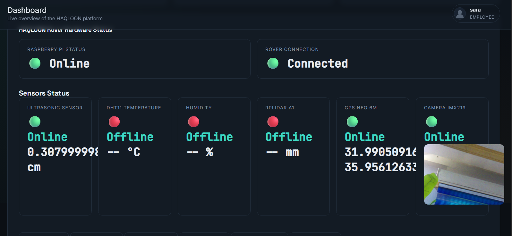
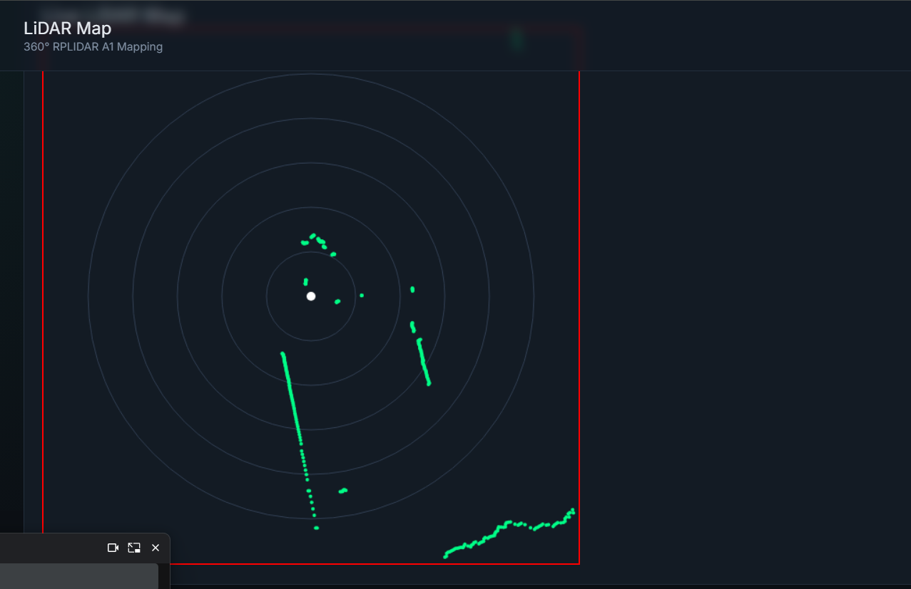

# HAQLOON Autonomous Agricultural Rover Platform

HAQLOON is a FastAPI monitoring and management platform for an autonomous
agricultural rover. It combines secure user management with live sensor status,
camera monitoring, GPS tracking, LiDAR visualization, AI detection, rover
controls, alerts, and notifications.

## Platform Preview





## Features

- **Secure login** — bcrypt-hashed passwords, signed session cookies (via
  Starlette's `SessionMiddleware`), CSRF tokens on every form.
- **Welcome page** — animated greeting after login, auto-redirects to the
  dashboard after 3 seconds, with a manual "Enter Dashboard" button.
- **Logout flow** — clears the session, shows an animated "Goodbye" page,
  then auto-redirects to the login page after 3 seconds. Logout is available
  from both the sidebar and the profile dropdown.
- **Profile management** — change full name, username, email, password, and
  profile picture. Requires the current password to save changes.
- **RBAC** — two roles, `admin` and `employee`, enforced server-side on every
  route (not just hidden in the UI).
- **Admin panel** — add/edit/delete users, search, enable/disable accounts,
  reset passwords, assign roles, system statistics, recent logins, and an
  activity log.
- **Protected routes** — every authenticated page redirects unauthenticated
  or unauthorized visitors back to `/login` (or `/dashboard` for
  employees hitting admin-only pages).

## Getting started

```bash
pip install -r requirements.txt
uvicorn app.main:app --reload
```

Then open `http://127.0.0.1:8000`. For local development, a default
administrator is created on first run:

| Username | Password       |
|----------|----------------|
| `admin`  | `Admin@12345`  |

**Change this password immediately.** For deployment, copy `.env.example` to
`.env` and configure `HAQLOON_SECRET_KEY`, `HAQLOON_ADMIN_USERNAME`,
`HAQLOON_ADMIN_EMAIL`, and `HAQLOON_ADMIN_PASSWORD`. Never commit `.env`.

## Project layout

```
app/
  main.py             FastAPI app, middleware, static files, startup seeding
  database.py          SQLAlchemy engine/session (SQLite by default)
  models.py             User and ActivityLog tables
  schemas.py            Pydantic validation for all form input
  security.py           bcrypt hashing + CSRF token helpers
  dependencies.py        Shared DB/session/current-user helpers
  templating.py           Shared Jinja2Templates instance
  routers/
    auth.py               /login, /welcome, /logout, /goodbye
    dashboard.py           /dashboard + role-gated feature pages (sensors,
                           camera, GPS, AI detection, rover controls, etc.)
    profile.py             /profile (view + update own account)
    admin.py                /admin/* (user management, stats, activity log)
  templates/              Jinja2 templates (mission-control visual theme)
  static/
    css/style.css           Design tokens + all component styles
    js/main.js               Profile dropdown behavior
    uploads/                 Uploaded profile pictures land here
```

## Roles & permissions

**Administrator** — full access: manage users (add/edit/delete/reset
password/change role/enable-disable), view and delete notifications and
alerts, change system settings, manage camera/AI detection/rover controls,
view all sensor data, export reports, and see every page including the
Admin Panel.

**Employee** — can log in, view the dashboard and every operational page
(sensors, camera, GPS, AI detection, rover controls, notifications), and
edit only their own username, password, and profile picture. Employees
cannot add/delete users, change roles, reach the admin panel, change global
settings, or delete alerts/notifications — these are blocked at the route
level, so a direct URL visit still redirects them away.

## Security notes

- Passwords are always stored as bcrypt hashes (`passlib[bcrypt]`), never
  in plain text.
- Sessions use Starlette's signed-cookie `SessionMiddleware`. The signing
  key is randomly generated per process by default — set the
  `HAQLOON_SECRET_KEY` environment variable to a stable, secret value in
  production so sessions survive restarts and are consistent across
  multiple app instances.
- Every state-changing form (login, profile update, admin actions) includes
  a per-session CSRF token that's verified server-side before anything is
  written to the database.
- All form input is validated with Pydantic (username format, email format,
  password strength) before touching the database.
- Login responses don't reveal whether a username exists — invalid username
  and invalid password return the same generic error.
- Set `https_only=True` on the `SessionMiddleware` in `main.py` once you're
  serving over HTTPS, so the session cookie is never sent in cleartext.
- The SQLite file (`haqloon.db`) is created next to the app on first run.
  Swap `SQLALCHEMY_DATABASE_URL` in `database.py` for Postgres/MySQL when
  you move to production.

## Notes on the operational pages

Operational routes include `/sensors`, `/camera`, `/gps`, `/ai-detection`,
`/rover`, `/lidar`, `/notifications`, and `/alerts`. The application accepts
rover telemetry through its backend routes and presents the latest available
state through access-controlled pages.
